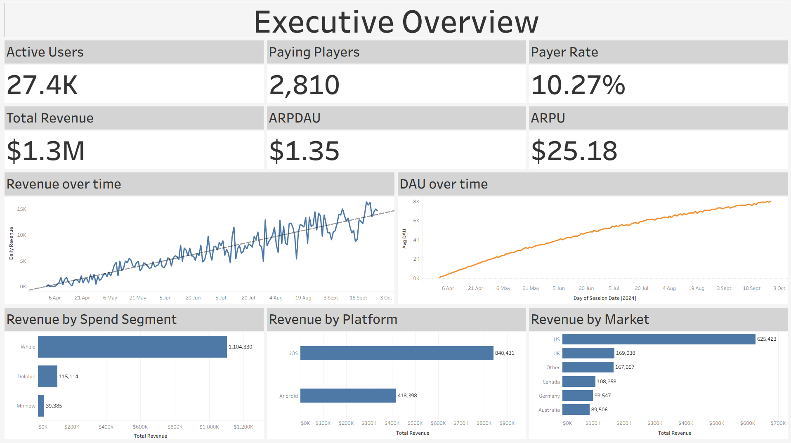
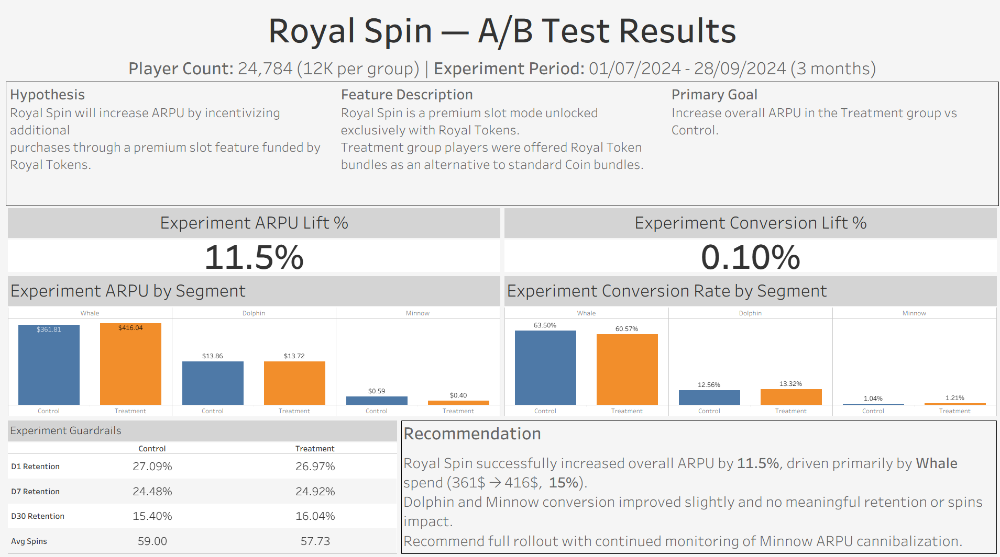
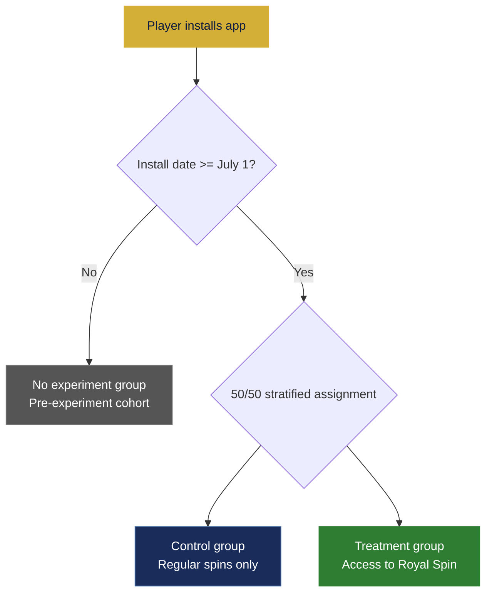

# Royal Flush Casino — Player behavior & A/B test analysis

> An end-to-end data analytics portfolio project simulating player behavior for a fictional social casino slot machine game. Built to demonstrate the analytics skills expected in a **Gaming Analyst** role: KPI design, cohort analysis, A/B test evaluation, and BI-ready data modeling.

**[Executive Overview Dashboard →](https://public.tableau.com/app/profile/danny.ezersky/viz/ProjectDashboardUpdated/ExecutiveOverview)**  |  **[A/B Test Results Dashboard →](https://public.tableau.com/app/profile/danny.ezersky/viz/ProjectDashboardUpdated/ExperimentDashboard)**

---

## Dashboards

### Executive Overview


### A/B Test Results


---

## Overview

SpinCrown Studios operates **Royal Flush Casino**, a mobile social casino slot machine. This project simulates 50,000 players across a 181-day period (April – September 2024), generates realistic behavioral data, and uses it to evaluate the impact of a new premium feature — the **Royal Spin mechanic** — through a controlled A/B experiment.

The full pipeline covers:

- Synthetic player and session data generation with configurable parameters
- A/B experiment simulation (Royal Spin feature, July – September 2024)
- 20+ SQL KPI queries across retention, revenue, engagement, and conversion
- BI-ready CSV exports structured as a star schema for dynamic Tableau calculation
- A/B test findings deck built programmatically in PowerPoint

---

## Key findings — Royal Spin A/B test

The Royal Spin mechanic introduced a new premium spin type funded by **Royal Tokens**, a purchasable in-app currency. Treatment players received access to this feature; Control players did not.

### Headline result

| Metric | Control | Treatment | Delta |
|---|---|---|---|
| ARPU | $13.59 | $15.15 | **+11.5%** |
| Conversion Rate | 3.97% | 4.07% | +0.10pp |
| D7 Retention | 25.29% | 25.78% | +0.49pp |
| D30 Retention | 21.75% | 22.52% | +0.77pp |
| Avg Spins / Session | 50.39 | 49.52 | -0.87 |

Retention and engagement guardrails all passed — the ARPU lift was driven purely by monetisation, not artificial inflation of playtime.

### Where the lift came from

**Spend segment breakdown:**

| Segment | Control ARPU | Treatment ARPU | Delta |
|---|---|---|---|
| Whale | $361.81 | $416.04 | **+15.0%** |
| Dolphin | $13.86 | $13.72 | -1.0% |
| Minnow | $0.59 | $0.40 | -32.2% |

The additive token model worked as designed for Whales — Royal Token purchases stacked on top of existing coin spend. For Dolphins and Minnows, the substitutive model caused mild **cannibalization**: Royal Token purchases partially replaced coin purchases. Net Dolphin impact was only -$69 across the experiment cohort — negligible in absolute terms. Minnow ARPU is so small that the percentage drop carries no meaningful revenue risk.

**Platform breakdown:**

| Platform | Control ARPU | Treatment ARPU | Delta |
|---|---|---|---|
| iOS | $16.55 | $18.37 | **+11.0%** |
| Android | $9.66 | $10.88 | **+12.7%** |

Both platforms responded similarly to the Royal Spin feature, with Android showing a slightly stronger relative lift.

**Royal Token revenue impact:**

Only **2.12%** of Treatment players purchased Royal Tokens — yet those players generated **$27,146**, accounting for **15.3%** of all Treatment revenue. A textbook high-value cohort effect amplified by the premium mechanic.

### Recommendation

- **Ship** Royal Spin to all players — the lift is consistent across platforms and no guardrails were triggered
- **Watch** Dolphin cannibalization — redesign the substitutive token model to additive before scaling
- **Monitor** Whale revenue concentration post-launch (91.0% in Treatment vs 88.7% in Control)

---

## Methodology notes

### Why no spike is visible on July 1st in overall metrics

The experiment enrolled players on their **install date**, not retroactively. Players who installed before July 1 were not assigned to a group — meaning experiment participants were a growing subset of the active population throughout July. By the time the cohort was large enough to move aggregate DAU or ARPU meaningfully, the signal had already been diluted across the full player base. This is expected **population dilution** and does not indicate a weak effect — the within-group comparison is the correct unit of analysis.

### Experiment validity — stratified randomization

Group assignment uses **stratified randomization** — a guaranteed 50/50 Control/Treatment split is enforced within each spend segment. This prevents group imbalances that would otherwise confound experiment results if, for example, Whales were over-represented in Treatment. Result: balanced groups of ~12,500 players each, with near-identical segment composition.



### Known limitation — static spend segments

Spend segments (Minnow, Dolphin, Whale) are assigned at **install time** using a fixed probability distribution and do not change based on observed player behavior. In production, segments would typically be derived from rolling spend windows and updated periodically. This simplification means the simulation cannot model segment migration. Treat segment-level findings as directional rather than precise.

### Statistical significance

Three tests were run against the full randomized cohorts (~12,400 players per group).

| Test | Metric | p-value | 95% CI | Result |
|---|---|---|---|---|
| Welch t-test | ARPU | 0.26 | (-$1.12, +$4.13) | Not significant |
| Mann-Whitney U | ARPU (rank-based) | 0.66 | n/a | Not significant |
| Two-proportion Z-test | Conversion rate | 0.67 | (-0.37pp, +0.58pp) | Not significant |

None clear the p < 0.05 threshold. The reason is structural: **96% of players spend $0**, so both tests are dominated by zeros. The median revenue is $0.00 in both groups — meaning Mann-Whitney, which works on ranks, effectively becomes a conversion rate test and finds the same result.

This is a known challenge with ARPU on skewed gaming revenue. The +11.5% point estimate reflects real Whale behavior but the confidence interval is too wide to be conclusive. The standard remedies are:
- **CUPED** — condition out pre-experiment revenue to reduce variance
- **Two-part model** — test conversion rate and ARPPU (among payers only) separately, each with lower variance than combined ARPU
- **Larger sample** — more players or a longer experiment window

### Further analysis — CUPED

The experiment used a simple pre/post comparison. In a production setting, applying **CUPED** (Controlled-experiment Using Pre-Experiment Data) would reduce variance in the ARPU estimate by conditioning on each player's pre-experiment revenue. With a 181-day simulation window and a 90-day experiment period, there is sufficient pre-experiment data for each cohort to make this tractable. CUPED would tighten confidence intervals and potentially surface significant effects in the Dolphin and Minnow segments that are currently inconclusive.

---

## SQL query library

27 queries across four categories, each runnable directly against `royal_flush_casino.db`.

**Core engagement**

| File | What it answers |
|---|---|
| `dau.sql` | Daily Active Users over time |
| `mau.sql` | Monthly Active Users over time |
| `dau_mau_ratio.sql` | DAU/MAU stickiness ratio by month |
| `avg_session_length.sql` | Average session duration in minutes per day |
| `avg_spin_count.sql` | Average spins per session per day |
| `churn.sql` | 14-day churn rate — players with no session in the last 14 days |

**Revenue & monetization**

| File | What it answers |
|---|---|
| `arpu.sql` | Average Revenue Per User across all players |
| `arppu.sql` | Average Revenue Per Paying User |
| `arpdau.sql` | Average Revenue Per Daily Active User |
| `payer_ratio.sql` | Share of active users who have made a purchase |
| `overall_conversion_rate.sql` | All-time payer conversion rate |
| `monthly_conversion_rate.sql` | Payer conversion rate by calendar month |
| `ftd.sql` | First-time deposit count by date |
| `ftd_30day_rate.sql` | % of players who make their first purchase within 30 days of install |
| `royal_token_conversion_rate.sql` | Royal Token adoption rate among Treatment players |
| `ltv_by_segment.sql` | LTV for all players and paying-only, broken out by spend segment |

**Retention**

| File | What it answers |
|---|---|
| `retention_d1.sql` | D1 retention rate by install date |
| `retention_d7.sql` | D7 retention rate by install date |
| `retention_d30.sql` | D30 retention rate by install date |

**A/B experiment**

| File | What it answers |
|---|---|
| `experiment_arpu.sql` | ARPU for Control vs Treatment |
| `experiment_arpu_by_segment.sql` | ARPU × spend segment × experiment group |
| `experiment_arpu_by_platform.sql` | ARPU × platform × experiment group |
| `experiment_arppu_by_segment.sql` | ARPPU × spend segment × experiment group |
| `experiment_conversion_rate.sql` | Payer conversion rate by experiment group |
| `experiment_ftd_30day.sql` | FTD 30-day rate by experiment group |
| `experiment_retention.sql` | D1/D7/D30 retention by experiment group |
| `experiment_spins_per_session.sql` | Average spins per session by experiment group |

---

## Project structure

```
royal-flush-casino/
│
├── simulate.py               # Entry point — runs the full simulation
├── config.py                 # All simulation parameters (player count, weights, dates)
├── db.py                     # SQLite schema definition
├── players.py                # Player generator (stratified experiment assignment)
├── spin_engine.py            # Spin outcome engine (RNG, payout logic)
├── session_simulator.py      # Session simulator (daily play, Royal Spin logic)
├── transaction_generator.py  # IAP transaction generator
│
├── sql/                      # 20+ KPI query files
│   ├── dau.sql               # Daily Active Users
│   ├── arpu.sql              # Average Revenue Per User
│   ├── retention_d1/d7/d30   # Cohort retention curves
│   ├── churn.sql             # 14-day churn window (ADR-0002)
│   ├── experiment_*.sql      # A/B test breakdowns
│   └── ...
│
├── export_tableau.py         # Generates star-schema CSVs for Tableau
│
├── exports/
│   ├── dim_players.csv       # One row per player — lifetime metrics + attributes
│   ├── fact_sessions.csv     # One row per player per day — session + revenue detail
│   ├── fact_transactions.csv # One row per transaction — IAP detail
│   ├── cohort_revenue.csv    # D7/D30/D60/D90 LTV per install-month cohort
│   └── royal_spin_ab_test.pptx
│
├── stats_test.py             # Welch t-test (ARPU) + Z-test (conversion rate) with CIs
├── build_presentation.py     # Builds the A/B test PowerPoint deck programmatically
│
├── tableau/
│   ├── Project Dashboard Updated.twb          # Tableau workbook
│   ├── dashboard_executive_overview.png       # Dashboard 1 screenshot
│   └── dashboard_ab_test.png                  # Dashboard 2 screenshot
│
├── tests/                    # pytest test suite (47 tests)
├── docs/
│   ├── adr/                  # Architecture Decision Records
│   └── prd-simulation-dataset.md
└── CONTEXT.md                # Domain model and design decisions
```

---

## How to run

**Requirements:** Python 3.11+, packages listed in `requirements.txt`

```bash
pip install -r requirements.txt
```

**1. Generate the database** (~2 minutes, deterministic)

Windows:
```bash
python simulate.py --seed 42
```
Mac/Linux:
```bash
python3 simulate.py --seed 42
```

This creates `royal_flush_casino.db` (~1.9 GB) with 50,000 players, their sessions, spins, and transactions across the full 181-day simulation period.

**2. Export CSVs for Tableau**

Windows:
```bash
python export_tableau.py
```
Mac/Linux:
```bash
python3 export_tableau.py
```

Writes three star-schema files to `exports/` — the database is not included in this repo due to its size.

**3. Build the A/B test presentation**

Windows:
```bash
python build_presentation.py
```
Mac/Linux:
```bash
python3 build_presentation.py
```

Writes `exports/royal_spin_ab_test.pptx`.

**4. Run the test suite**

Windows:
```bash
python -m pytest
```
Mac/Linux:
```bash
python3 -m pytest
```

---

## Tableau dashboards

The dashboards cover DAU/MAU trends, ARPU, retention curves, A/B experiment results, and segment breakdowns — all calculated dynamically from the star-schema exports.

- **[Executive Overview](https://public.tableau.com/app/profile/danny.ezersky/viz/ProjectDashboardUpdated/ExecutiveOverview)** — active users, revenue, ARPU, ARPPU, payer ratio, DAU/MAU, and market breakdown
- **[A/B Test Results](https://public.tableau.com/app/profile/danny.ezersky/viz/ProjectDashboardUpdated/ExperimentDashboard)** — experiment setup, headline lift, ARPU by segment, retention guardrails, and group composition

---

## Tech stack

| Tool | Usage |
|---|---|
| **Python** | Simulation engine, data generation, export scripting |
| **SQLite** | Relational database storing all player, session, and transaction data |
| **SQL** | 20+ KPI queries covering retention, revenue, engagement, and A/B analysis |
| **Tableau Public** | Interactive BI dashboards with dynamic KPI calculation |
| **python-pptx** | Programmatic PowerPoint generation for the A/B test findings deck |
| **Claude Code** | AI-assisted development — simulation design, query authoring, export logic |

---

## Simulation parameters

| Parameter | Value |
|---|---|
| Players | 50,000 |
| Simulation period | Apr 1 – Sep 28, 2024 (181 days) |
| Experiment period | Jul 1 – Sep 28, 2024 (90 days) |
| Spend segments | Minnow 90% / Dolphin 7% / Whale 3% |
| Platforms | iOS 58% / Android 42% |
| Markets | US 48% / UK 13% / DE 9% / CA 8% / AU 7% / Other 15% |
| Daily play probability | Minnow 22% / Dolphin 50% / Whale 80% |
| Churn window | 14 days (ADR-0002) |
| Random seed | 42 |
